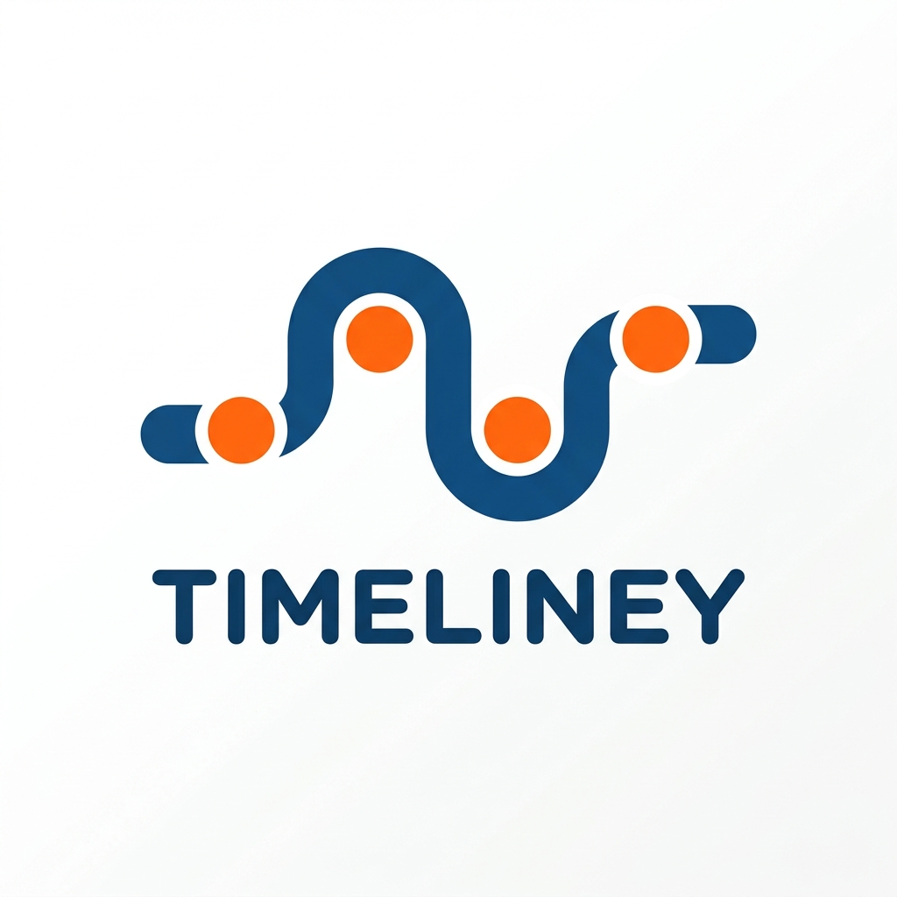
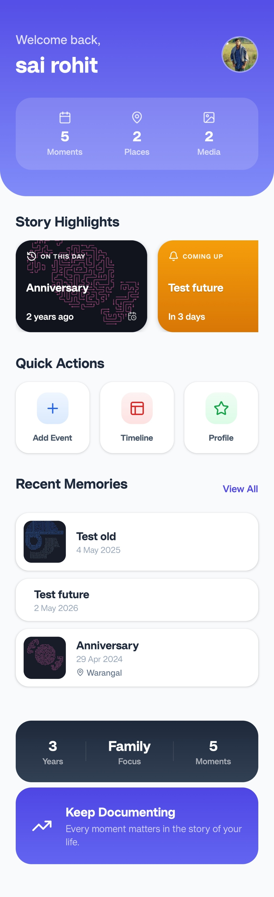
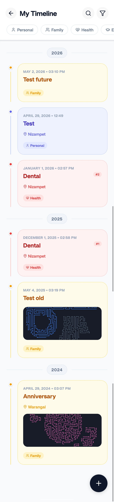
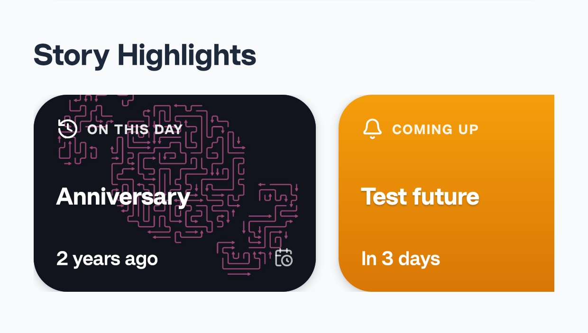
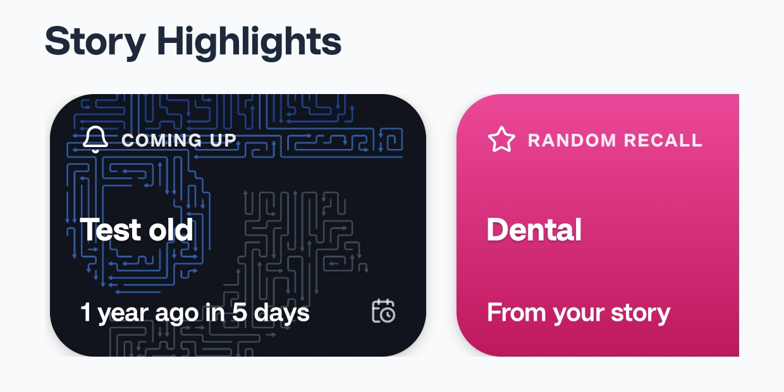

<p align="center">
  
</p>

# Timeliney 👋

Timeliney is a powerful, privacy-focused life logging application designed to help you document, organize, and relive your life's journey. From daily moments to major milestones, Timeliney turns your history into a beautiful, interactive story.

## ✨ Features

### 📊 Interactive Dashboard
Your life at a glance. The dashboard surfaces relevant insights every day:
- **On This Day:** Relive memories from exactly 1, 2, or 10 years ago.
- **Coming Up:** Never miss an anniversary or a future milestone.
- **Life Summary:** View statistics about your journey, including total moments captured and your life's primary focus areas.
- **Random Flashbacks:** Stay connected to your past with unexpected "Recall" moments.

### 📅 Dynamic Timeline
A seamless chronological stream of your experiences. The timeline allows you to:
- Browse your entire history with smooth, animated transitions.
- Filter events by tags or categories.
- Search for specific moments using titles or descriptions.

### 🌟 Story Highlights
Focus on what matters most. Highlights curate your most significant milestones and media-rich events, presenting them in a visually stunning format.

### ☁️ Secure Google Drive Sync
Your data stays with you. Timeliney integrates directly with your Google Drive to:
- Provide seamless cross-device synchronization.
- Automatically backup your events, photos, and documents.
- Ensure your history is never lost, even if you switch devices.

### 📂 Event Series & Media
- **Series Tracking:** Group related events (like a vacation or a learning journey) into a cohesive series.
- **Rich Media:** Attach photos, videos, and documents to any event to preserve the full context of the moment.

---

## 📸 Screenshots

| Dashboard | Timeline | Highlights |
| :---: | :---: | :---: |
|  |  |  |

---

## 🚀 Getting Started

### Prerequisites
- [Node.js](https://nodejs.org/) (v18 or newer)
- [Expo Go](https://expo.dev/go) on your mobile device or an Emulator (Android/iOS)

### Installation

1. **Clone the repository**
   ```bash
   git clone https://github.com/yourusername/timeliney.git
   cd timeliney
   ```

2. **Install dependencies**
   ```bash
   npm install
   ```

3. **Configure Environment**
   Create a `.env` file or update your `app.json` with your Google Cloud Console credentials for Google Sign-In and Drive API access.

4. **Start the development server**
   ```bash
   npx expo start
   ```

---

## 🛠️ Tech Stack
- **Framework:** [Expo](https://expo.dev/) / React Native
- **State Management:** [Zustand](https://github.com/pmndrs/zustand)
- **Styling:** React Native StyleSheet / [Lucide Icons](https://lucide.dev/)
- **Animations:** [React Native Reanimated](https://www.reanimated2.com/)
- **Backend/Storage:** Google Drive API for data persistence and media storage.

---

## 📄 License
This project is licensed under the MIT License.
